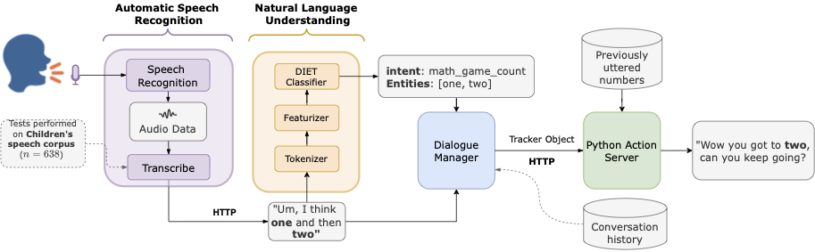

# Toys are a Child's Best Friend

This repository contains the code for the investigation project 'Toys are a Child's Best Friend', conducted at the University of the Witwatersrand.

## Architecture

The system architecture is based on a spoken dialogue system with the following components:

- Automatic Speech Recognition
- Natural Language Understanding
- Dialogue Management
- Text-to-Speech

## Methodology

Based on research that suggests verbal counting contributes to Early Childhood Development, the proposed methodology aims to assess whether a child can interact verbally with a toy. Verbal counting is defined as the ability to utter a sequence of numbers in the correct order. The designed toy should be able to evaluate whether the uttered sequence of numbers is correct and communicate this back to the child.

The methodology involves the following steps:

1. Automatic Speech Recognition (ASR): Mapping an acoustic utterance to a string of text.
2. Natural Language Understanding (NLU): Parsing the text to infer if the child is currently counting and extracting the numbers for computation.
3. Dialogue Management (DM): Controlling the conversational flow and verifying the validity of the number sequence.
4. Text-to-Speech: Communicating the results back to the child.

### Automatic Speech Recognition

The ASR component converts the child's acoustic utterance to a string of text. In this work, pre-trained models are used to assess their performance on children's speech. The models selected are Wav2Vec 2.0 and Whisper. Wav2Vec 2.0 is trained on unlabelled speech data, while Whisper is trained on labelled speech data. The performance and complexity trade-off between different variants of these models are compared.

### Natural Language Understanding

The NLU component parses the text to identify the child's intention to engage in verbal counting (intent) and extract the numbers uttered (entities). The parsing process involves a CountVectorizer Feature (CVF) that generates a sparse matrix of features by counting the occurrences of n-grams in the text. The matrix is then used by the DIETClassifier, a transformer-based classifier, to classify the intents and entities.

### Dialogue Management

The DM component controls the conversational flow and verifies the validity of the number sequence. Rasa Core's Policy pipeline is used for this purpose, where training data consisting of intent-action pairs is used to train the policy. A custom Python action server takes in a tracker object containing the intents and entities and applies custom logic to determine the validity of the sequence. The results are communicated back to the child.

The overall methodology is depicted in the figure above, showing the flow of information and the interaction between the components. The rest of this section provides a detailed explanation of the tools used to address the research questions mentioned in the next section.

